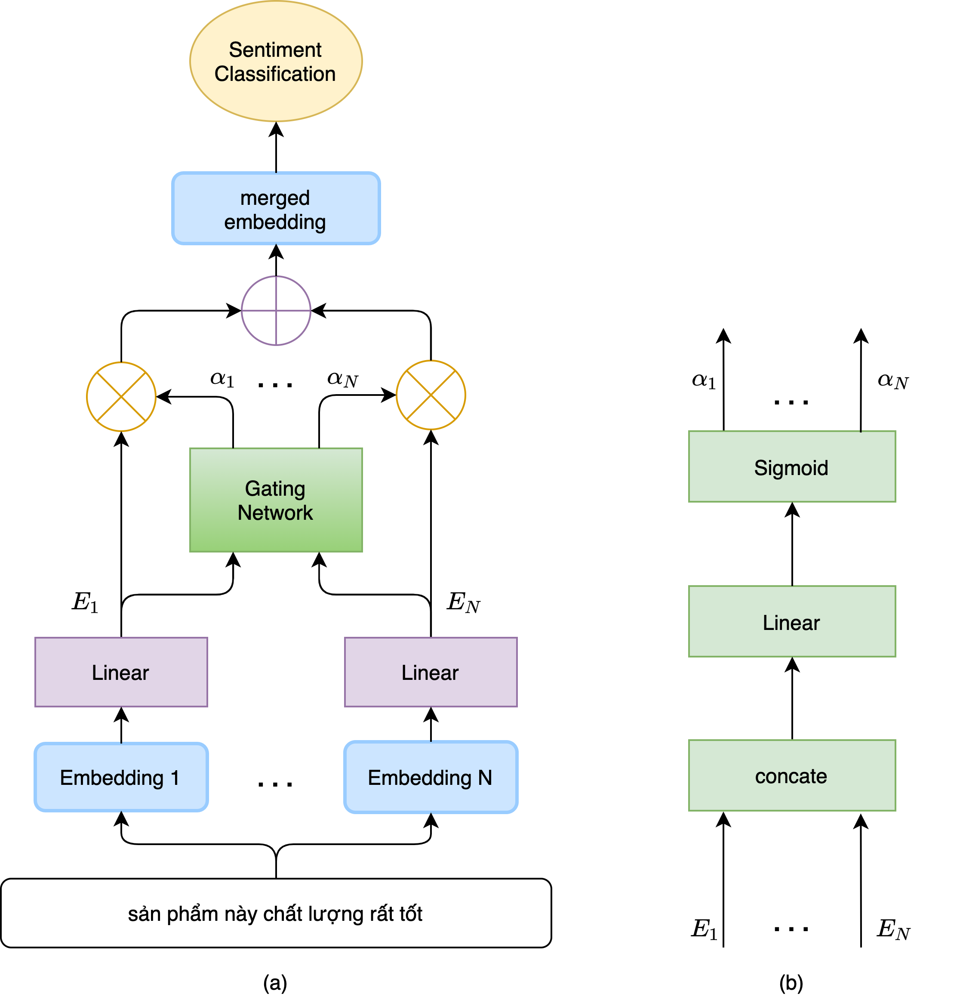

# LIFA: A Multi-source Transfer Learning Framework for Vietnamese Sentiment Classification
This is the official code for the paper **[Learning for Amalgamation: A Multi-Source Transfer Learning Framework for Sentiment Classification](https://www.sciencedirect.com/science/article/abs/pii/S0020025521012809?via%3Dihub)** (Information Sciences 2022). 

Authors: Cuong V. Nguyen and Khiem H. Le and Anh M. Tran and Quang H. Pham and Binh T. Nguyen

### Contents:
* [x] Paper Overview
* [x] Requirement
* [x] Datasets
	* [x] AIVIVN
	* [x] Our dataset
* [x] Pre-trained Models
* [x] Training
	* [x] Training
	* [x] Evaluating Dialogue States
* [x] Citation
* [x] Contact

## Overview  

 
Our proposed LIFA framework using a gating network. (a) The overall framework demonstrated on N embeddings. (b) Our Gating Network architecture. It is worth noting that from given input data, LIFA can select N different embedding models (which can have distinct embedding dimensions) for extracting feature vectors. These feature vectors then go through linear transformation layers to project these feature vectors into the same feature space. Finally, a gating network can be employed for combining these newly computed features to learn an optimal classifier for the sentiment classification problem.

## Requirement  
* python                    3.7.3
* pytorch                   1.4.0
* pytorch-transformers      1.2.0
* tensorflow                2.0.0
* torchtext                 0.4.0
* torchvision               0.4.0
* scikit-image              0.15.0
* scikit-learn              0.20.3
* nltk                      3.4.5
* fairseq                   0.9.0
* vncorenlp                 1.0.3

## Data preparation 
* In this work, we use two datasets:
  * AIVIVN: this is the publish dataset from AIVIVN 2019 Sentiment Challenge, including approximately 160K training reviews with the available labels and 11K testing reviews without the available labels. We manually did labelling for the testing dataset.
  * Our dataset: this is our new dataset which was crawled from the Vietnamese e-commerce websites, the reviews are started from Jan 2019 and includes all product categories. We trained all the methods with 10K, 15K, 20K training reviews respectively and tested on about 170K reviews.
  * The validation dataset is randomly selected from the training dataset, with 20%.
  * The two datasets are placed at the folders dataset/aivivn/ and dataset/tiki/.

## Pre-trained Models preparation 
* BERT: which is the pre-trained BERT model with the version of bert-base-multilingual-uncased and automatically downloaded from Huggingface Transformers.
* PhoBERT: which is the state-of-the-art pre-trained BERT model for the Vietnamese language. To run with the pre-trained PhoBert models, we need to do:
  * Download https://public.vinai.io/PhoBERT_base_transformers.tar.gz, extract and place at */phobert
  * Download vncorenlp from https://github.com/VinAIResearch/PhoBERT#vncorenlp, extract and place at */vncorenlp

## Training  

## Citation 

If you find the paper or the source code useful to your projects, please cite the following bibtex: 
<pre>
@article{lifa,
  author = {Cuong V. Nguyen and Khiem H. Le and Anh M. Tran and Quang H. Pham and Binh T. Nguyen},
  title = {Learning for amalgamation: A multi-source transfer learning framework for sentiment classification},
  journal = {Information Sciences},
  volume = {590},
  pages = {1-14},
  year = {2022},
  issn = {0020-0255},
  doi = {https://doi.org/10.1016/j.ins.2021.12.059},
}
</pre>

## Contact 

For any requests to further use these codes and our proposed algorithms for the Vietnamese Sentiment Classification problem, please kindly contact authors to avoid any misused action or violation to the copyright of all authors and creators of this repository.

Contact Email: ngtbinh@hcmus.edu.vn (Dr. Binh Nguyen)